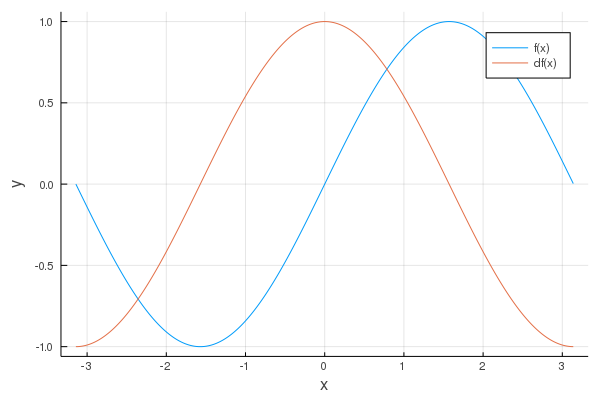

# 微積分

## 数値微分

関数の数値微分を行う．

数値微分は，以下の微分の定義


に則って，微小な正の数を決めて


によって近似することで導関数を求める．これを2点近似と呼ぶ．



## 台形則による数値積分

関数の数値微分を行う．


数値積分は，定積分の近似値を級数和として求める．

微小区間の区間幅をとする．この区間内の肝数値を一次方程式で近似すると，積分値は


となるので，区間内の積分は各微小区間内での積分値の和で表されることから，以下のように書くことが出来る．


```bash
Analytical=2
Numerical=1.9998355038874436
```