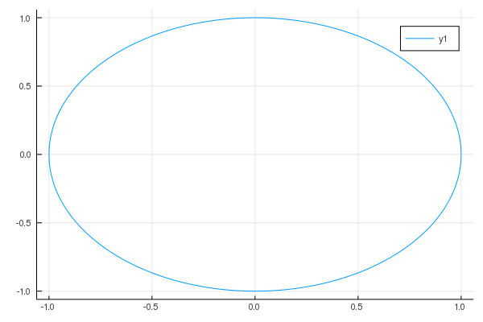

# Juliaの基本

プログラミング言語Juliaは動的プログラミング言語であり，科学分野や計算処理に適した非常に高いパフォーマンスを誇る言語．

https://julialang.org/

* インストール（Mac OS）

```bash
$  brew cask install julia
```

* インストール (ubuntu)

```bash
$ git clone https://github.com/JuliaLang/julia.git
$ cd julia
$ git checkout v1.3.1
$ make -j2
```

## 四則演算
[=> 回答](./operation.jl)

Juliaを用いた基本的な四則演算を試す．
，として，

*   
*   
*   
*   

を計算し出力する．


## 総和・総乗
[=> 回答](./sum_prod.jl)

繰り返し評価を使って以下の総和および総乗を計算する．

*   
*   

ここで，変数のスコープに注意する．  
グローバルに宣言された変数 `x` に代入を行うには `global x += 1` というふうにしなければいけない．


## 関数の定義
[=> 回答](./def_function.jl)

以下の関数を定義し，のときの値を計算する．


上記の関数は関数の逆関数を微分したものである．


## 関数のプロット
[=> 回答](./plot_function.jl)

先程定義した以下の関数をでプロットする．
Juliaでプロットを行うには `Plots` パッケージを追加する必要がある．


**実行例**  


## 三角関数
[=> 回答](./trigonometric.jl)

Juliaには三角関数が予め用意されている．
をでプロットする．

**実行例**  


## ラジアンと角度の変換
[=> 回答](./deg_rad.jl)

ここでは角度をラジアンに変換する．
角度の弧度法への変換は以下のように行うことが出来る．


ここではおよびとして計算し，結果を出力する．


## アルキメデスの渦
[=> 回答](./archimedean_spiral.jl)

デカルト座標系の点は極座標上の点で表現できる（極座標変換）．

* 
* 

ここで，で描かれる曲線をアルキメデスの渦と呼ぶ．
上記に従って，アルキメデスの渦をプロットする．


**実行例**  


## オイラーの公式
指数関数と三角関数の間に，以下の関係が成り立つことが知られており，この公式をオイラーの公式と呼ぶ．


このをガウス平面上にプロットする．

**実行例**  
[=> 回答](./eulers_formula.jl)



## マクローリン展開
[=> 回答](./maclaurins_expansional.jl)

のマクローリン展開は，


となる．

としてマクローリン展開を計算し，ネイピア数を求める．


## フェルマーテスト
[=> 回答](./fermat_test.jl)

フェルマーテストは，フェルマーの小定理の対偶を利用した素数判定法．

フェルマーの小定理
>素数について，と互いに素な整数に対して以下が成り立つ．
>

が合成数のとき，上記の等式は成り立たない可能性があることを利用して，素数判定を行う．

**フェルマーテスト**  
以下の試行を1セットとして，複数回試行を繰り返す．
1. を，からまでの数からランダムに選ぶ
2. とが互いに素でないとき，は合成数
3. ならは合成数

試行回数を100として，57および23が素数かどうか判定する．

