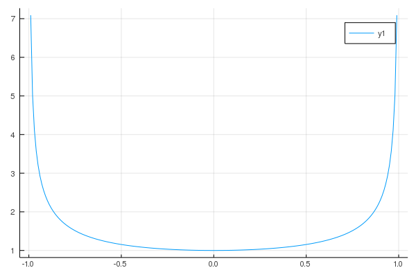
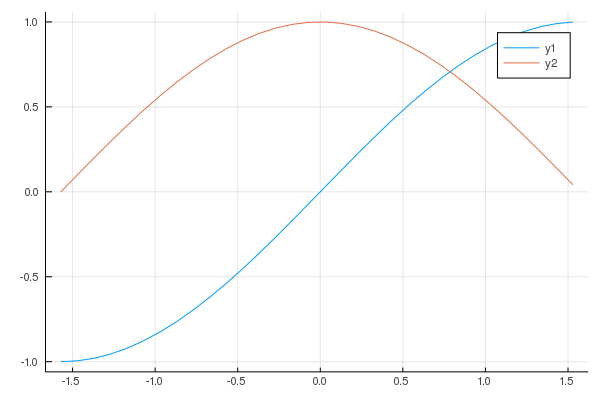
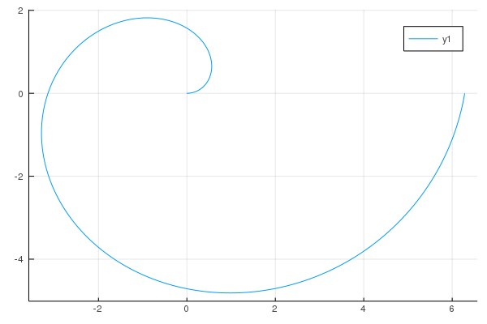

# Juliaの基本

プログラミング言語Juliaは動的プログラミング言語であり，科学分野や計算処理に適した非常に高いパフォーマンスを誇る言語．

https://julialang.org/

* インストール（Mac OS）

```bash
$  brew cask install julia
```

* インストール (ubuntu)

```bash
$ git clone https://github.com/JuliaLang/julia.git
$ cd julia
$ git checkout v1.3.1
$ make -j2
```

## 四則演算
Juliaを用いた基本的な四則演算を試す．
，として，


を計算し出力する．

実行例

```bash
a+b=8
a-b=-2
axb=15
a/b=0.6
```

## 総和・総乗
繰り返し評価を使って以下の総和および総乗を計算する．

* 
* 

ここで，変数のスコープに注意する．グローバルに宣言された変数```x```に代入を行うには```global x += 1```というふうにしなければいけない．

実行例

```bash
sum=110
prod=3715891200
```

## 関数の定義

以下の関数を定義し，のときの値を計算する．


上記の関数は関数の逆関数を微分したものである．

実行例

```bash
x=0: 1.0
x=0.5: 1.1547005383792517
```

## 関数のプロット
先程定義した以下の関数をでプロットする．
Juliaでプロットを行うには```Plots```パッケージを追加する必要がある．


実行例



## 三角関数
Juliaには三角関数が予め用意されている．
をでプロットする．

実行例



## ラジアンと角度の変換
ここでは角度をラジアンに変換する．
角度の弧度法への変換は以下のように行うことが出来る．


ここではおよびとして計算し，結果を出力する．

実行例

```bash
theta=60: 1.0471975511965976
theta=80: 1.3962634015954636
```

## アルキメデスの渦
デカルト座標系の点は極座標上の点で表現できる（極座標変換）．

* 
* 

ここで，で描かれる曲線をアルキメデスの渦と呼ぶ．
上記に従って，アルキメデスの渦をプロットする．


実行例


