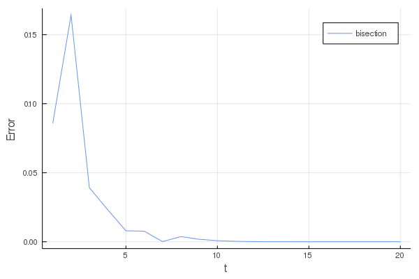

# 非線形方程式

## 1. 二分法による非線形方程式
二分法によっての解を求める．
ここで初期値は，とする．

### 二分法
関数がであるとに対して，

, 0">

を満たす連続関数であると仮定する．これに対し， 以下の反復計算によって解を求める．

ステップ1. の符号を調べる．

ステップ2.

(i) のとき，

(ii) 0">のとき，

(iii) のとき，

求める解はであるので計算を終了する．

