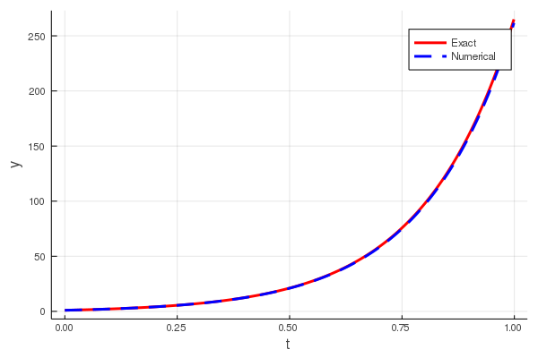

# 常微分方程式

## 1. Euler法による1階常微分方程式
以下の１階常微分方程式をEuler法によって解く．

### Euler法
関数のまわりにおけるテイラー展開は，以下で表される．

ここで，とおくと，

と書ける．上記のテイラー展開を１次まで考えてそれ以降の項を無視するとき，この差分方程式の局所打ち切り誤差はであると言い，これをEuler法と呼ぶ．まとめると，

となる．

