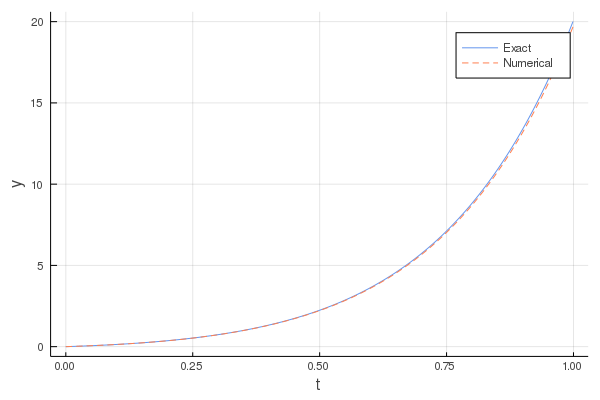

# 常微分方程式

## Euler法による1階常微分方程式
以下の１階常微分方程式をEuler法によって解く．


### Euler法
関数のまわりにおけるテイラー展開は，以下で表される．


ここで，とおくと，


と書ける．上記のテイラー展開を１次まで考えてそれ以降の項を無視するとき，この差分方程式の局所打ち切り誤差はであると言い，これをEuler法と呼ぶ．まとめると，


となる．


## Euler法による2階常微分方程式
以下の2階常微分方程式をEuler法によって解く．

, （初期条件：で，）

### 解析解

与式より，特性方程式を解くと，


したがって与式の一般解は，


また，初期条件より，

,


より，求める一般解は，




## 質点の１次元運動（自由落下）
質点の運動は，次の運動方程式に支配される．


ここで，
* : 力
* : 質量
* : 加速度
* : 速度
* : 位置
* : 時刻

この運動方程式を元に，最も単純な落下運動である**自由落下**を考える．

重力以外の力が働かない**自由落下**の状態では，地球上では加速度は定数となる．この定数を重力加速度と呼ぶ．
自由落下の場合には，上記の運動方程式は解析的に解くことが出来る．速度と速度の初期値および位置と位置の初期値をそれぞれとすると，それぞれの関係は，

* 
* 

となり，これを解くことで自由落下の運動を求めることが出来る．
しかし，実際の多くの問題は，このように運動方程式が解析的に解けるとは限らない．

上記に基づいて，Euler法によって運動方程式を求める．ここで重力加速度```g=9.80665```，初期速度および初期位置は，```(v_0, x_0) = (0, 100)```と```(v_0, x_0)=(-100, 100)```のそれぞれについて計算を行い，軌道をプロットする．

実行例

```v_0 = 0, x_0 = 100```


```v_0 = -100, x_0 = 100```


## 質点の１次元運動（着陸船）
自由落下の問題を応用して，逆噴射を行って軟着陸する着陸船ロケットの軌道を計算することが出来る．
ここでは，逆噴射を行う際の燃料消費による質量の変化などの条件は無視するものとする．
実験では，逆噴射の加速度は一定とし，ある時刻から逆噴射を始めるものとする．

上記に従って，軟着陸の軌道を計算し，プロットする．
ここで，```(v_0, x_0, s, a)=(0, 100, 2, 1.2)```とする（```s```は逆噴射を開始する時刻，```a```は逆噴射の加速度）．

実行例

